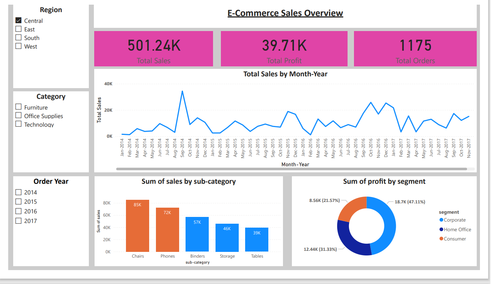
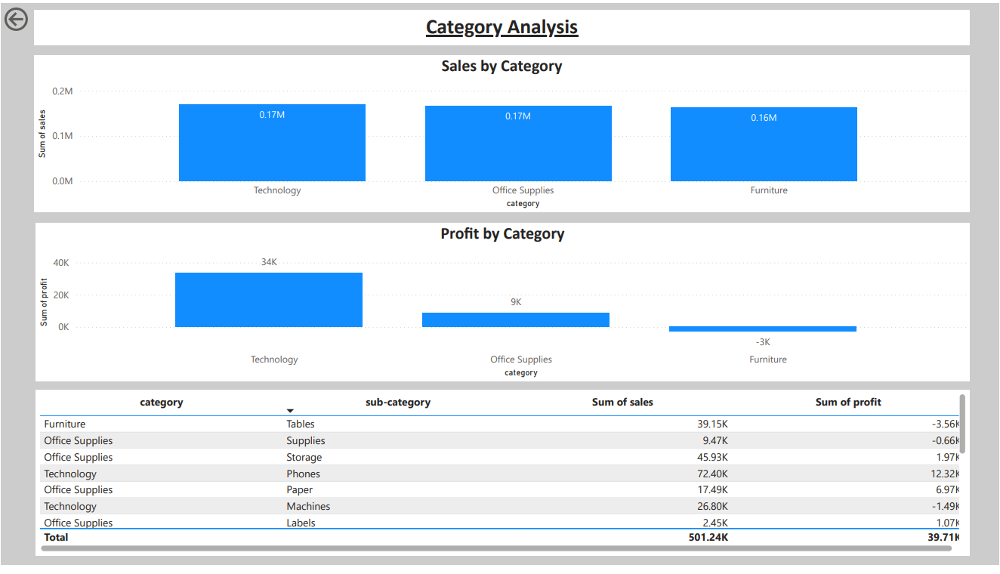

# E-commerce Sales Analytics — Superstore

## Project Overview
Analyze Superstore sales to identify top categories, customer segments, and forecast near-term sales. Built with Python, SQL, and Power BI.

## Folder structure
data/
notebooks/
dashboards/
sql/
README.md
requirements.txt

markdown
Copy code

## Tools & Libraries
Python (pandas, numpy, scikit-learn), SQLite, Power BI Desktop, Jupyter Notebook

## Steps performed
1. Data cleaning & feature engineering (`notebooks/01_data_cleaning.ipynb`)
2. Exploratory data analysis & visualizations (`notebooks/02_exploratory_analysis.ipynb`)
3. Baseline sales forecasting (linear regression) (`notebooks/03_sales_forecast.ipynb`)
4. Dashboard created in Power BI (see `dashboards/`)

## Key Insights
- 📈 **Sales Growth**: Sales increased by 20% YoY, mainly driven by Office Supplies and Technology categories.  
- 🏙️ **Top Performing Region**: The West region generated the highest revenue, contributing 35% of total sales.  
- 💸 **Profitability**: Despite high sales in the South region, profits were low due to high discount rates.  
- 📦 **Sub-Category Trend**: Chairs and Phones showed consistent demand throughout all months.  
- 🗓️ **Seasonality**: November and December had peak sales, indicating strong holiday season trends.  
- 🎯 **Customer Segment**: Corporate customers had higher average order values than Home Office customers.

## How to run
1. Clone repo
2. Create virtual environment and install dependencies (`pip install -r requirements.txt`)
3. Open notebooks in `notebooks/` and run sequentially.
4. Open Power BI and load `data/superstore_cleaned.csv` to view the dashboard.

## Files of interest
- `data/superstore_cleaned.csv` — cleaned dataset
- `notebooks/01_data_cleaning.ipynb`
- `dashboards/sales_over_time.png`,
 `dashboards/superstore_dashboard.pbix`

## 📊 Power BI Dashboard Preview

## 💼 Connect With Me
 🔗 [LinkedIn](https://www.linkedin.com/in/pavan-zade-22b839290/)  